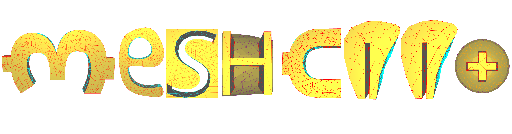

# Surface class segmentation in CAD models with MeshCNN

[MeshCNN](https://github.com/ranahanocka/MeshCNN) is a general-purpose deep neural network for 3D triangular meshes, which can be used for tasks such as 3D shape classification or segmentation. This framework includes convolution, pooling and unpooling layers which are applied directly on the mesh edges.

 <br>

Project by [Andrés Mandado](mailto:mandadoalmajano@campus.tu-berlin.de)<br>
Tutor [Maximilian Kohlbrenner](mailto:kohlbrenner@tu-berlin.de)
            
# Getting Started

### Installation
- Clone this repo:
```bash
git clone https://gitlab.cg.tu-berlin.de/sempro/cgp-ws20-meshcnn.git
cd cgp-ws20-meshcnn
```
- Install dependencies with conda (creates an environment called cgp-meshcnn-basic):
`conda env create -f basic_environment.yml` 
  
### ABC Dataset surface class segmentation
Download the dataset
```bash
bash ./scripts/seg/get_10K_dataset.sh
```

Run training (if using conda env first activate env e.g. ```source activate meshcnn```)
```bash
bash ./scripts/seg/train.sh
```

To view the training loss plots, in another terminal run ```tensorboard --logdir runs``` and click [http://localhost:6006](http://localhost:6006).

Run test and export the intermediate pooled meshes:
```bash
bash ./scripts/seg/test.sh
```

Visualize the network-learned edge collapses:
```bash
bash ./scripts/seg/view.sh
```

Some segmentation result examples:

   

Note, you can also get pre-trained weights using bash ```./scripts/seg/get_pretrained.sh```. 

### Additional Datasets
The same scripts also exist for a synthetic dataset. 

# More Info
Check out the [website](http://cybertron.cg.tu-berlin.de/p/cgp-ws20/meshcnn) for more details.