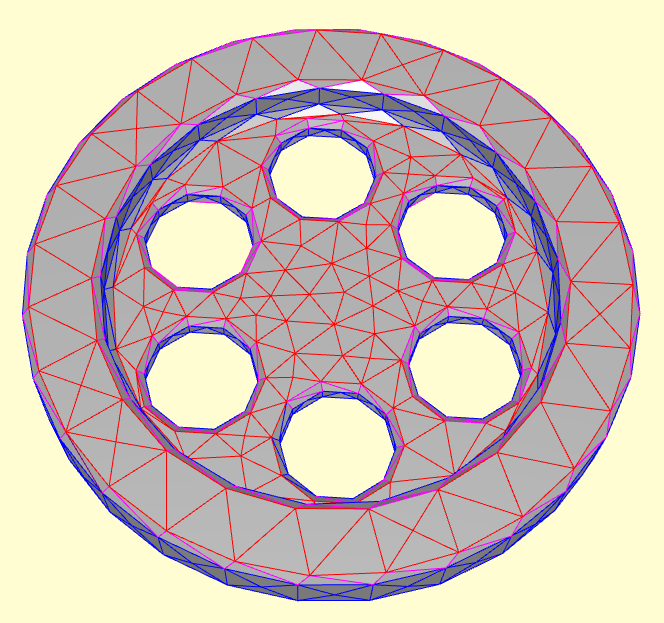
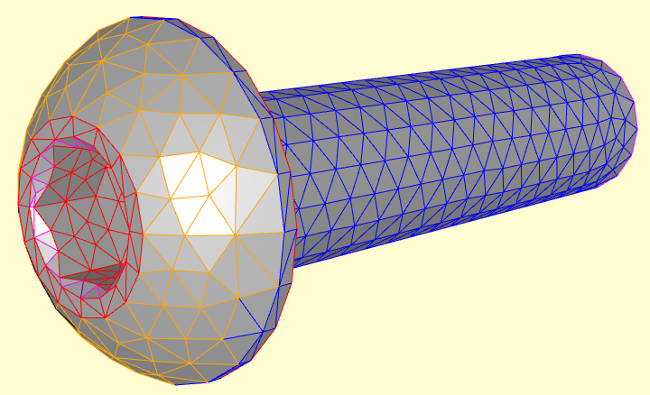
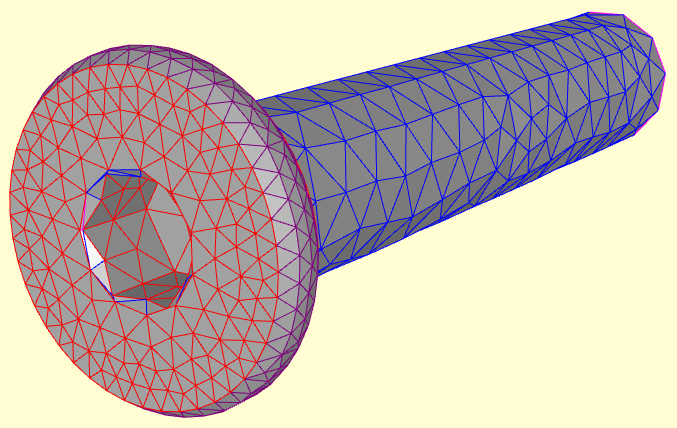
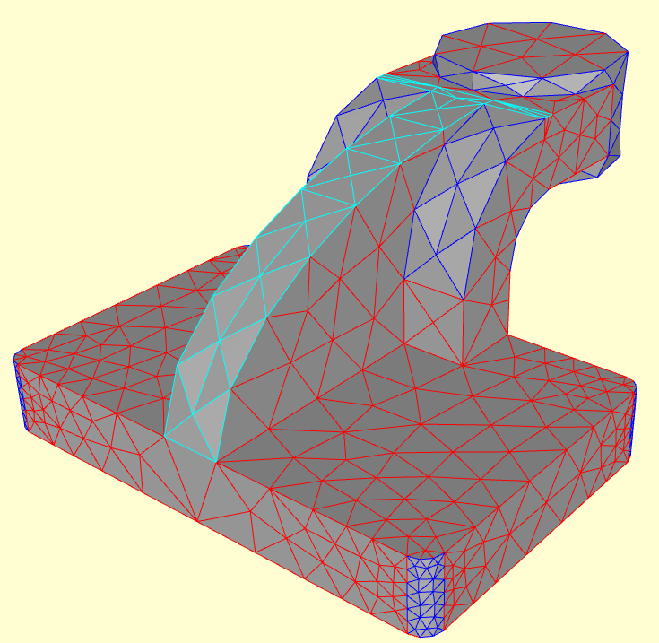

# Surface class segmentation in CAD models with MeshCNN

This project modifies [MeshCNN](https://github.com/ranahanocka/MeshCNN) to handle large meshes efficiently and applies the improved framework to learn surface type segmentation on [ABC Dataset](https://deep-geometry.github.io/abc-dataset/), a large dataset of CAD models.

 <br>

Project by [Andrés Mandado](mailto:andresmandado@gmail.com)<br>
            
# Getting Started

### Installation
- Clone this repo:
```bash
git clone https://github.com/atomicsulfate/meshcnn-4-cadseg.git
cd meshcnn-4-cadseg.git
```
- Install dependencies with conda (creates an environment called cgp-meshcnn-basic):
```bash
cd development
conda env create -f basic_environment.yml
```
 
### ABC Dataset surface class segmentation
Download the dataset
```bash
bash ./scripts/seg/get_10K_dataset.sh
```

Run training (if using conda env first activate env e.g. ```conda activate cgp-meshcnn-basic```)
```bash
bash ./scripts/seg/train.sh
```

To view the training loss plots, in another terminal run ```tensorboard --logdir runs``` and click [http://localhost:6006](http://localhost:6006).

Run test and export the intermediate pooled meshes:
```bash
bash ./scripts/seg/test.sh
```

Visualize the network-learned segmentation vs labels:
```bash
bash ./scripts/seg/view.sh
```

Some segmentation result examples:

   

Note, you can also get pre-trained weights using bash ```./scripts/seg/get_pretrained.sh```. 

# Project structure
- **development**
    * **meshcnn:** Original meshcnn code (unchanged).
    * **data, models:** meshcnn extensions (e.g. sparse pooling, distributed training). 
    * **test.py, train.py:** Test and train scripts.
    * **scripts**
        + **prepro:** Scripts for data preprocessing, synthetic sample generation, mesh visualization...
        + **seg:** Scripts to execute basic workflow: train,test,view results.
- **docs**
    * [website](https://atomicsulfate.github.io/meshcnn-4-cadseg/)
